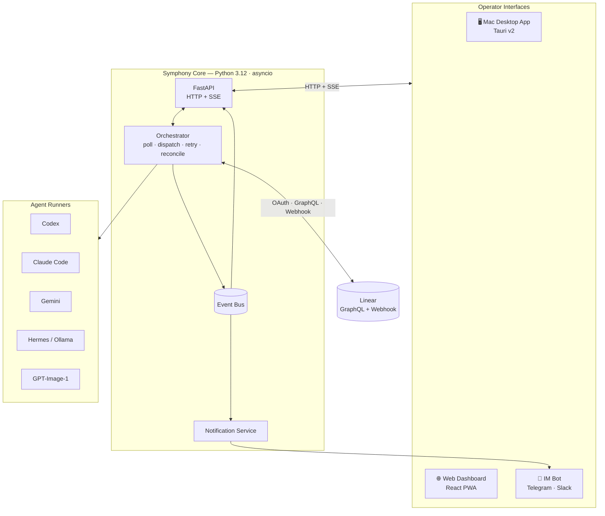
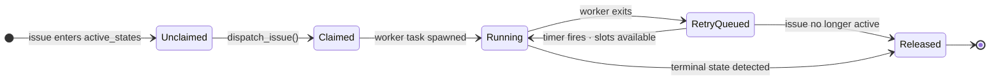

# Symphony — Python Implementation

> A production-ready, out-of-box implementation of the [Symphony specification](SPEC.md) by OpenAI.
> Licensed under the [Apache License 2.0](LICENSE).

---

## Background

Symphony was created by OpenAI as an open framework for autonomous software development. The original README describes it this way:

> *Symphony turns project work into isolated, autonomous implementation runs, allowing teams to **manage work** instead of **supervising coding agents**.*

The core idea: engineers set goals in Linear and let Symphony dispatch agents against those goals. Agents do the implementation, provide proof of work — CI status, PR review feedback, complexity analysis — and hand off to humans for acceptance. Engineers operate at the level of issues, not prompts.

OpenAI published a language-agnostic [`SPEC.md`](SPEC.md) and one experimental reference implementation in Elixir. The README explicitly invites other implementations:

> *Tell your favorite coding agent to build Symphony in a programming language of your choice.*

**This repository is one such implementation.** It is a derivative work of the original Symphony project, fully conforming to `SPEC.md`, and extends the original design with multiple AI agent backends, a Mac desktop app, and IM-based remote coordination.

---

## What This Implementation Adds

The Elixir reference implementation requires Elixir/OTP expertise and a developer-CLI workflow. This implementation's goal is simpler:

> **Download the app. Connect Linear. Choose an agent. Ship.**

| Capability | Original (Elixir) | This implementation |
|---|---|---|
| Agent backend | Codex only | Codex, Claude Code, Gemini, Hermes/Ollama, GPT-Image-1 |
| Installation | `mix setup` + CLI | `.dmg` drag-to-install (no Python required) |
| First-run setup | Hand-edit WORKFLOW.md | Guided setup wizard |
| Linear auth | Personal API key | OAuth 2.0 + API key |
| Issue updates | Polling (30 s) | Webhooks (< 1 s) + polling fallback |
| Operator alerts | Dashboard only | Telegram / Slack push notifications |
| Mobile approval | Not supported | Approve/reject agent actions from phone |

---

## Architecture



The orchestrator is a single Python asyncio event loop — one authoritative in-memory state, no database required. All operator interfaces (desktop app, web dashboard, IM bots) are read-only consumers connected via HTTP and Server-Sent Events. See [ARCHITECTURE.md](ARCHITECTURE.md) for the full system design and data-flow walkthroughs.

### Orchestration state machine



---

## Key Features

### Multiple AI agent backends

Configure any agent in `WORKFLOW.md`:

```yaml
agent:
  runner: claude_code      # codex | claude_code | gemini_api | openai_compatible | gpt_image
  model: claude-sonnet-4-6
```

All runners expose the same event interface to the orchestrator. The `linear_graphql` client-side tool (from `SPEC.md §10.5`) is available to every agent — they can update issue state, post comments, and attach PR links without holding a raw Linear token.

### Linear as the primary interface

Issues are goals. States are workflow stages. Symphony connects to Linear via OAuth 2.0 or a personal API key, registers a webhook for real-time state change notification (< 1 s reaction), and exposes a setup wizard that generates a valid `WORKFLOW.md` from a UI form.

### Mac desktop app

Distributed as a signed `.dmg` — no Python, no terminal. The Tauri v2 shell manages the Python daemon as a bundled sidecar, renders the web dashboard in a native window, shows a menubar icon with live agent count, and fires native macOS notifications when agents need attention.

### IM remote control (Telegram / Slack)

Symphony sends push notifications to a configured Telegram group or Slack channel for key events: issue moved to Human Review, agent blocked, stall timeout, worker failed, approval requested. Operators can approve or reject agent action gates directly from their phone with inline action buttons.

```
"MT-60 requesting approval: `git push --force`"
[Approve ✓]  [Reject ✗]   (expires in 5 min)
```

### WORKFLOW.md as the team contract

Runtime behavior — prompt template, poll interval, concurrency limits, agent config, workspace hooks — lives in a `WORKFLOW.md` file versioned with the codebase. Changes are detected and re-applied without restarting the service.

---

## Ideal User Experience

**First run (desktop):**

1. Download `Symphony.dmg` → drag to Applications → open
2. Setup wizard: Connect to Linear (OAuth) → select project → configure states
3. Choose agent → paste API key
4. Preview generated `WORKFLOW.md` → save to repo → launch
5. Dashboard opens; first poll in progress

**Day-to-day (operator on phone):**

- Telegram: *"MT-42 — Human Review: Add retry to payment processor [Open PR]"*
- Review PR → approve in Linear → agent lands the PR
- Telegram: *"MT-42 — Done. Merged."*

**When something goes wrong:**

- Telegram: *"MT-60 stalled — no activity for 5 min [Retry] [Cancel]"*
- Tap Cancel → issue returns to active queue

---

## Key Design Decisions

| Decision | Rationale | SPEC reference |
|---|---|---|
| Python 3.12 + asyncio | Best subprocess orchestration; all AI SDKs available; `asyncio.TaskGroup` for N concurrent agents | SPEC §3.2 |
| In-memory orchestrator state | Recovery is tracker-driven; no database required | SPEC §14.3 |
| Polling + webhooks hybrid | Webhooks for < 1 s reaction; polling as safety net at 2 min interval | SPEC §8.1 |
| WORKFLOW.md hot reload | Config + prompt changes apply without restart; invalid reload keeps last known good | SPEC §6.2 |
| `on-request` approval default | Operators can approve agent actions from phone; overridable to `never` for trusted envs | SPEC §15.1 |
| `workspace-write` sandbox default | Agent confined to its per-issue workspace directory | SPEC §9.5 |

---

## Status

This implementation is under active design. See [`prd.md`](prd.md) for the full product requirements and build queue, and [`ARCHITECTURE.md`](ARCHITECTURE.md) for the detailed system design.

> [!WARNING]
> Not yet ready for production use. Design phase in progress.

---

## Attribution

Symphony and its specification (`SPEC.md`) were created by OpenAI and are licensed under the [Apache License 2.0](LICENSE). This repository is an independent implementation of that specification. The original project is at [github.com/openai/symphony](https://github.com/openai/symphony).
