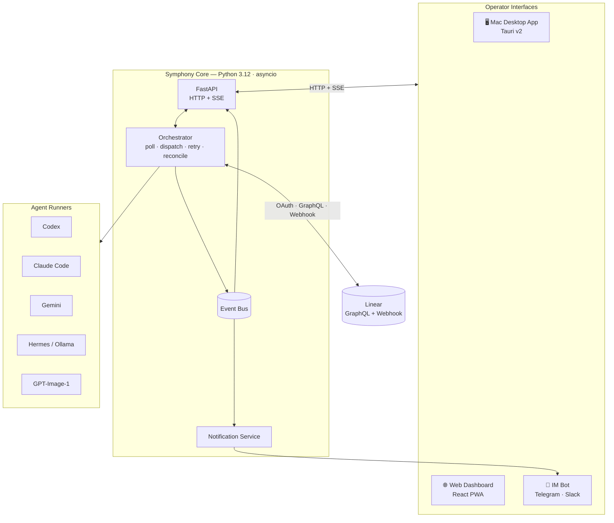
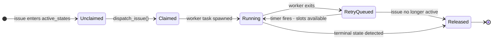

这个这个# Symphony — Python Implementation

> A production-ready, out-of-box implementation of the [Symphony specification](SPEC.md) by OpenAI.
> Licensed under the [Apache License 2.0](LICENSE).

---

## Background

Symphony was created by OpenAI as an open framework for autonomous software development. The original README describes it this way:

> *Symphony turns project work into isolated, autonomous implementation runs, allowing teams to **manage work** instead of **supervising coding agents**.*

The core idea: engineers set goals in Linear and let Symphony dispatch agents against those goals. Agents do the implementation, provide proof of work — CI status, PR review feedback, complexity analysis — and hand off to humans for acceptance. Engineers operate at the level of issues, not prompts.

OpenAI published a language-agnostic [`SPEC.md`](SPEC.md) and one experimental reference implementation in Elixir. The README explicitly invites other implementations:

> *Tell your favorite coding agent to build Symphony in a programming language of your choice.*

**This repository is one such implementation.** It is a derivative work of the original Symphony project, fully conforming to `SPEC.md`, and extends the original design with multiple AI agent backends, a Mac desktop app, and IM-based remote coordination.

---

## Get Started: CLI MVP

The current working slice is the **Python CLI MVP for Linear + Codex**. It can
load a repository `WORKFLOW.md`, poll Linear for active issues, prepare an
isolated per-issue workspace, run a Codex app-server turn, and maintain retry /
reconciliation state.

The desktop app, OAuth setup flow, Linear webhooks, richer dashboard, and
additional agent backends are planned follow-on phases.

### Requirements

- Python 3.12+
- [`uv`](https://docs.astral.sh/uv/) for dependency and command execution
- A Linear API key with access to the target project
- Codex CLI authenticated locally and able to run `codex app-server`
- A repository-owned `WORKFLOW.md`

### Install Dependencies

```bash
uv sync
```

### Generate A Workflow

Use the onboarding command for the normal first run:

```bash
uv run symphony init --project-slug your-linear-project-slug
```

This writes `WORKFLOW.md` from the default `codex-safe` preset and can store a
Linear API key in the local Symphony credential file instead of the repository.
For non-interactive setup:

```bash
uv run symphony init \
  --yes \
  --project-slug your-linear-project-slug \
  --linear-api-key lin_api_...
```

Available presets are `codex-safe`, `codex-autonomous`, and `review-only`.

### Create A WORKFLOW.md

You can also create or edit `WORKFLOW.md` manually. A minimal CLI MVP workflow
looks like this:

```yaml
---
tracker:
  kind: linear
  project_slug: "your-linear-project-slug"
  active_states:
    - Todo
    - In Progress
  terminal_states:
    - Done
    - Canceled
    - Duplicate

polling:
  interval_ms: 30000

workspace:
  root: ~/code/symphony-workspaces

agent:
  runner: codex            # codex (default) | claude_code
  max_concurrent_agents: 1
  max_turns: 20

codex:
  command: codex app-server
  approval_policy: never
  thread_sandbox: workspace-write
---

You are working on Linear issue {{ issue.identifier }}.

Title: {{ issue.title }}
State: {{ issue.state }}
URL: {{ issue.url }}

Description:
{{ issue.description }}

Work only inside the provided workspace. When finished, report the changes and
validation evidence. If the `linear_graphql` tool is available, post progress
back to the issue.
```

Use workspace hooks when you need each issue workspace to clone or bootstrap a
repo before Codex runs:

```yaml
hooks:
  after_create: |
    git clone https://github.com/your-org/your-repo .
  before_run: |
    uv sync
  after_run: |
    git status --short
```

### Configure Linear Auth

The CLI MVP uses a Linear API key. `symphony init` can store it in
`~/.config/symphony/credentials.json`, or you can provide it through the
environment:

```bash
export LINEAR_API_KEY=lin_api_...
```

You can also put `tracker.api_key: "$LINEAR_API_KEY"` in `WORKFLOW.md`. Keep raw
tokens out of committed workflow files.

### Validate Configuration

```bash
uv run symphony doctor /path/to/WORKFLOW.md
```

Expected result:

- workflow parses successfully
- Linear token resolves
- Codex command is available
- workspace root is writable
- logs root and status API port are printed

### Run One Poll Tick

Use `--once` for smoke tests and controlled live-dispatch proof:

```bash
uv run symphony run /path/to/WORKFLOW.md --once --log-level INFO
```

This fetches candidate Linear issues, dispatches eligible active issues, waits
for started workers in that tick, and prints a summary like:

```text
Tick OK: fetched=1 dispatched=1 completed=1 failed=0 released=0
```

### Run The Poll Loop

For continuous local operation:

```bash
uv run symphony run /path/to/WORKFLOW.md --port 7337 --logs-root ./log --log-level INFO
```

Stop the process with `Ctrl-C`.

### Useful Validation Commands

```bash
uv run python -m unittest discover -s tests -p 'test_*.py'
uv run symphony --help
git diff --check
```

See [`test-plan-epic-2.md`](test-plan-epic-2.md) for the live-dispatch test
plan used to close the remaining Phase 1 proof gap.

---

## What This Implementation Adds

The Elixir reference implementation requires Elixir/OTP expertise and a developer-CLI workflow. This implementation's goal is simpler:

> **Download the app. Connect Linear. Choose an agent. Ship.**

| Capability | Original (Elixir) | This implementation |
|---|---|---|
| Agent backend | Codex only | Codex now; Claude Code, Gemini, Hermes/Ollama, GPT-Image-1 planned |
| Installation | `mix setup` + CLI | Python CLI now; `.dmg` drag-to-install planned |
| First-run setup | Hand-edit WORKFLOW.md | Hand-edit now; guided setup wizard planned |
| Linear auth | Personal API key | API key now; OAuth 2.0 planned |
| Issue updates | Polling (30 s) | Polling now; webhooks + polling fallback planned |
| Operator alerts | Dashboard only | Status API handler now; Telegram / Slack planned |
| Mobile approval | Not supported | Planned approval gates from phone |

---

## Architecture



The orchestrator is a single Python asyncio event loop — one authoritative in-memory state, no database required. All operator interfaces (desktop app, web dashboard, IM bots) are read-only consumers connected via HTTP and Server-Sent Events. See [ARCHITECTURE.md](ARCHITECTURE.md) for the full system design and data-flow walkthroughs.

### Orchestration state machine



---

## Key Features

### Available In The CLI MVP

**Linear-driven dispatch.** Symphony reads active Linear issues, normalizes issue
payloads, respects active/terminal states, and dispatches eligible work with
bounded concurrency.

**Repository-owned workflow contract.** Runtime policy lives in `WORKFLOW.md`:
tracker settings, polling interval, workspace root, lifecycle hooks, Codex
command, sandbox policy, and the prompt template rendered for each issue.

**Per-issue workspace lifecycle.** Each issue gets a deterministic isolated
workspace under `workspace.root`. Workspace keys are sanitized, root containment
is enforced, hooks can run at lifecycle boundaries, and terminal cleanup is
supported.

**Codex app-server runner.** The current concrete runner launches Codex in
app-server mode, sends rendered issue prompts, normalizes events, handles
timeouts/malformed frames, tracks token usage, and cleans up subprocesses.

**Linear tool routing.** The injected `linear_graphql` tool lets Codex post
comments, update state, and attach PR links through Symphony-managed Linear
auth without giving the agent a raw token.

**Offline-testable status surface.** The minimal status API handler covers
health, state, per-issue detail, and refresh behavior. Full dashboard/SSE
operation is planned for a later phase.

### Agent Backends

Switch agents with one line in `WORKFLOW.md`:

```yaml
agent:
  runner: claude_code      # codex (default) | claude_code
```

**Codex** (default) — requires `codex app-server` and uses Codex's JSON-RPC
app-server protocol.

**Claude Code** — requires the `claude` CLI authenticated locally. Set
`LINEAR_API_KEY` as usual; Symphony injects it into the subprocess so Claude
can post comments and update issues via Bash without any extra configuration.

```yaml
agent:
  runner: claude_code

claude_code:               # all fields optional
  model: claude-sonnet-4-6
  turn_timeout_ms: 3600000
```

Additional backends (Gemini, OpenAI-compatible, GPT-Image-1) are planned. All
runners expose the same event interface to the orchestrator.

### Linear as the primary interface

Issues are goals. States are workflow stages. The CLI MVP connects to Linear
with a personal API key and polls for active issues. OAuth 2.0, webhook
registration, and a setup wizard are Phase 2 productionization work.

### Mac desktop app

Planned distribution is a signed `.dmg` with no Python or terminal setup. The
Tauri v2 shell will manage the Python daemon as a bundled sidecar, render the
web dashboard in a native window, show a menubar icon with live agent count, and
fire native macOS notifications when agents need attention.

### IM remote control (Telegram / Slack)

Planned IM integrations will send push notifications to a configured Telegram
group or Slack channel for key events: issue moved to Human Review, agent
blocked, stall timeout, worker failed, approval requested. Operators will be
able to approve or reject agent action gates directly from their phone with
inline action buttons.

```
"MT-60 requesting approval: `git push --force`"
[Approve ✓]  [Reject ✗]   (expires in 5 min)
```

### WORKFLOW.md as the team contract

Runtime behavior -- prompt template, poll interval, concurrency limits, Codex
config, and workspace hooks -- lives in a `WORKFLOW.md` file versioned with the
codebase.

---

## Ideal User Experience

**First run (desktop):**

1. Download `Symphony.dmg` → drag to Applications → open
2. Setup wizard: Connect to Linear (OAuth) → select project → configure states
3. Choose agent → paste API key
4. Preview generated `WORKFLOW.md` → save to repo → launch
5. Dashboard opens; first poll in progress

**Day-to-day (operator on phone):**

- Telegram: *"MT-42 — Human Review: Add retry to payment processor [Open PR]"*
- Review PR → approve in Linear → agent lands the PR
- Telegram: *"MT-42 — Done. Merged."*

**When something goes wrong:**

- Telegram: *"MT-60 stalled — no activity for 5 min [Retry] [Cancel]"*
- Tap Cancel → issue returns to active queue

---

## Key Design Decisions

| Decision | Rationale | SPEC reference |
|---|---|---|
| Python 3.12 + asyncio | Best subprocess orchestration; all AI SDKs available; `asyncio.TaskGroup` for N concurrent agents | SPEC §3.2 |
| In-memory orchestrator state | Recovery is tracker-driven; no database required | SPEC §14.3 |
| Polling + webhooks hybrid | Webhooks for < 1 s reaction; polling as safety net at 2 min interval | SPEC §8.1 |
| WORKFLOW.md hot reload | Config + prompt changes apply without restart; invalid reload keeps last known good | SPEC §6.2 |
| `on-request` approval default | Operators can approve agent actions from phone; overridable to `never` for trusted envs | SPEC §15.1 |
| `workspace-write` sandbox default | Agent confined to its per-issue workspace directory | SPEC §9.5 |

---

## Status

This implementation has a working CLI-first MVP for Linear + Codex and is
moving into Phase 2 productionization. See [`prd.md`](prd.md) for the full
product requirements and build queue, [`ARCHITECTURE.md`](ARCHITECTURE.md) for
the detailed system design, and [`test-plan-epic-2.md`](test-plan-epic-2.md)
for the live-dispatch closeout plan.

> [!WARNING]
> Not yet ready for production use. The CLI MVP is available for local testing;
> desktop packaging, OAuth, webhooks, and the full operator dashboard are still
> planned work.

---

## Attribution

Symphony and its specification (`SPEC.md`) were created by OpenAI and are licensed under the [Apache License 2.0](LICENSE). This repository is an independent implementation of that specification. The original project is at [github.com/openai/symphony](https://github.com/openai/symphony).
