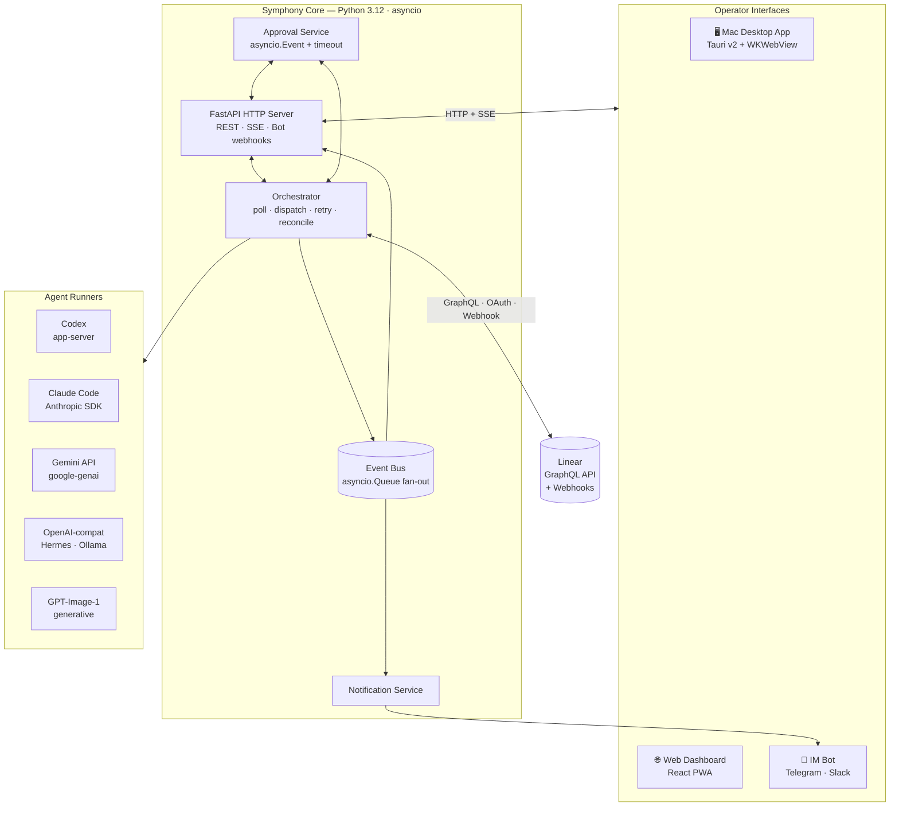
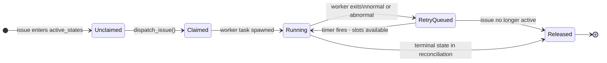
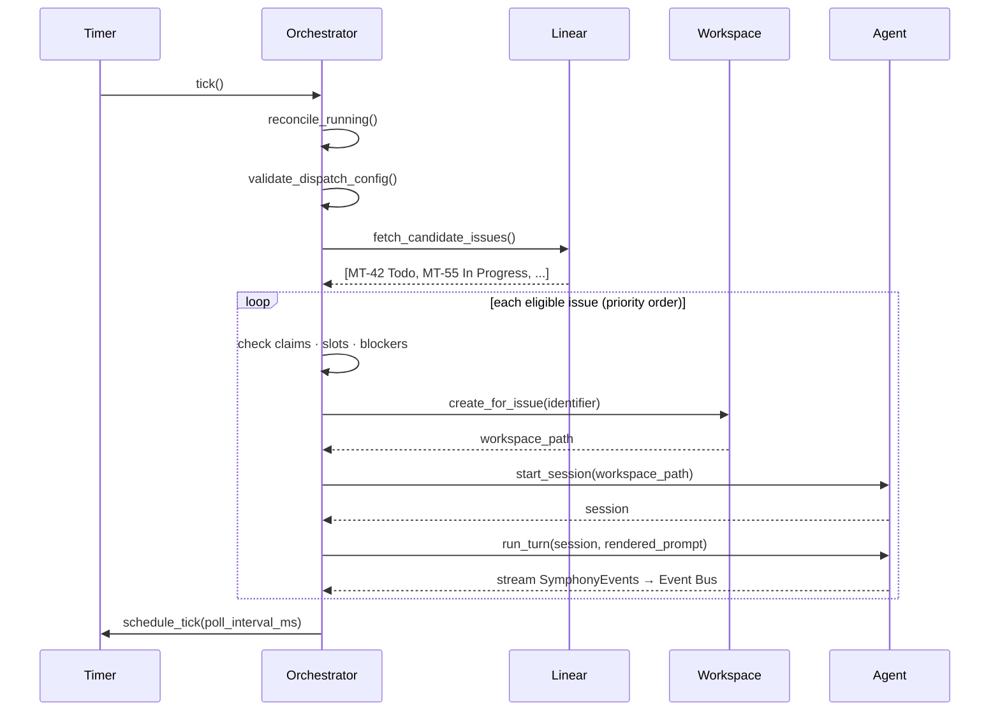
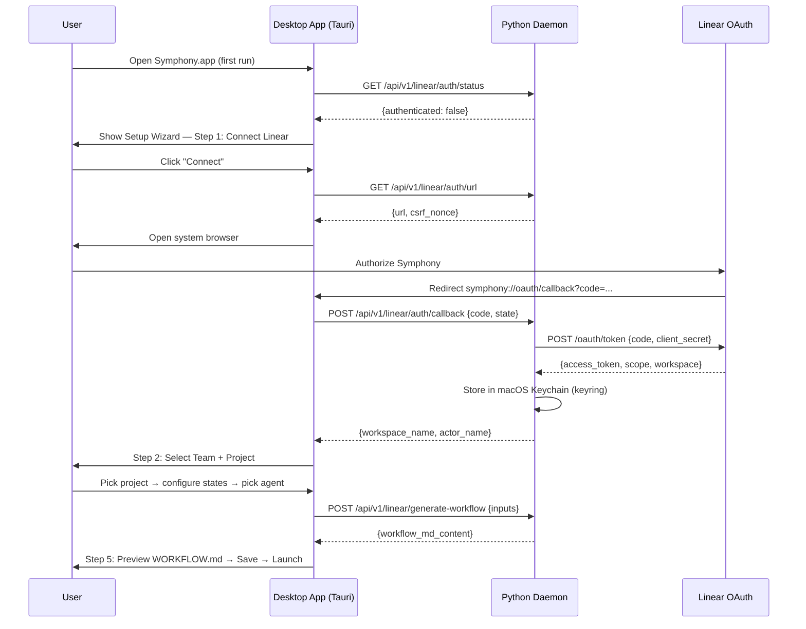
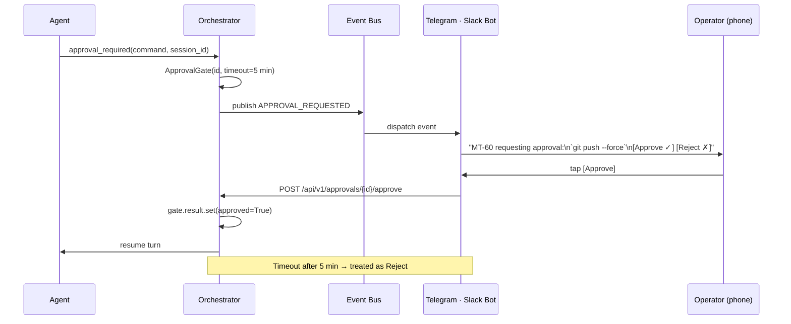

# Symphony — Python Implementation PRD

> See [ARCHITECTURE.md](ARCHITECTURE.md) for the detailed system design, component contracts, and data-flow walkthroughs.

---

## 1. Background

Symphony was introduced by OpenAI as an open framework for autonomous software development. The central idea — expressed in the [original README](README.md) — is a shift in how engineering teams relate to AI agents:

> *Symphony turns project work into isolated, autonomous implementation runs, allowing teams to **manage work** instead of **supervising coding agents**.*

Rather than running an agent and watching it type, engineers set goals in Linear and let Symphony dispatch, monitor, and coordinate agents against those goals. Agents provide proof of work — CI status, PR review feedback, walkthrough videos — and humans make acceptance decisions. The loop closes when a PR lands.

The core design is published as [`SPEC.md`](SPEC.md), a **language-agnostic specification** that any team can implement in the language of their choice. OpenAI's own reference implementation is in Elixir (`elixir/`). The README explicitly invites alternative implementations:

> *Tell your favorite coding agent to build Symphony in a programming language of your choice: implement Symphony according to the following spec.*

This repository is **one such implementation**. It is a derivative work of the original Symphony project, licensed under the [Apache License 2.0](LICENSE), and is intended to be a production-ready, out-of-box installable version of the system.

---

## 2. Goal of This Implementation

The Elixir reference implementation is technically excellent — OTP supervision, hot reload, per-issue process isolation — but it demands Elixir/Erlang expertise that most teams do not have, and its installation story is developer-CLI-first.

**This implementation has one primary goal:**

> Make Symphony accessible to any engineering team without requiring them to know Elixir, manage a daemon process, or edit YAML files before seeing the system work.

Concretely, that means:

- **Install an app. Connect Linear. Choose an agent. Ship.**
- Full conformance with [`SPEC.md`](SPEC.md) §3–§14 — every normative requirement honored.
- Multiple AI agent backends so teams are not locked to Codex.
- A Mac desktop app with a system tray, embedded dashboard, and native notifications.
- Real-time coordination via Telegram or Slack so operators can stay in the loop from a phone.
- A guided setup wizard that generates a valid `WORKFLOW.md` without hand-editing.

Symphony's non-goals from the original SPEC are preserved: no multi-tenant control plane, no general-purpose workflow engine, no prescriptive sandbox policy. This implementation adds distribution and UX polish, not new orchestration semantics.

---

## 3. Architecture

### 3.1 System Overview

### 3.2 Orchestration State Machine

The orchestrator's internal claim state for each issue (distinct from the Linear ticket state):

Backoff formula (from SPEC §8.4):
- **Normal exit** (continuation): fixed 1 000 ms delay
- **Failure exit**: `min(10 000 × 2^(attempt−1), max_retry_backoff_ms)`, default cap 5 min

### 3.3 Poll-and-Dispatch Tick

### 3.4 Linear OAuth & Setup Wizard

### 3.5 IM Approval Gate

---

## 4. Key Features

### 4.1 Multiple AI Agent Backends

The original Elixir implementation is coupled to Codex app-server. This implementation introduces a clean `AgentRunner` abstraction so any agent can be plugged in via configuration:

| Runner | Config value | Protocol |
|---|---|---|
| Codex | `runner: codex` | Codex app-server JSON-RPC over stdio |
| Claude Code | `runner: claude_code` | Anthropic Python SDK streaming |
| Gemini | `runner: gemini_api` | google-genai SDK function-calling |
| Hermes / Ollama | `runner: openai_compatible` | OpenAI-protocol + `base_url` override |
| GPT-Image-1 | `runner: gpt_image` | `openai.images.generate` API (generative, no turn loop) |

All runners expose identical events to the orchestrator: `session_started`, `turn_completed`, `turn_failed`, `notification`, `approval_requested`. The orchestrator never knows which backend is running.

### 4.2 Linear as Primary Coordination Interface

Linear is not just a data source — it is the team's interface to Symphony. Issues are goals; states are workflow stages; comments are the agent's audit trail.

**Authentication:** Personal API key (env var, CLI, CI) or OAuth 2.0 (desktop app). Token stored in macOS Keychain for desktop users; `~/.symphony/credentials.json` for CLI users.

**Real-time coordination via webhooks:** Instead of polling every 30 seconds, Symphony registers a Linear webhook and reacts to state changes within one second. Polling continues as a reconciliation safety net (at a reduced 2-minute interval).

**`linear_graphql` agent tool:** The orchestrator exposes a `linear_graphql` tool to agent sessions (per SPEC §10.5). Agents can update issue state, post workpad comments, attach PR links, and create follow-up issues — all through Symphony's configured auth. The agent never needs a raw Linear token.

### 4.3 Mac Desktop App

Symphony is distributed as a native macOS application. No Python, no terminal, no pip install.

| Component | Technology |
|---|---|
| App shell | Tauri v2 (Rust) |
| Python daemon | PyInstaller sidecar binary |
| Dashboard UI | React/Svelte, rendered in WKWebView |
| Distribution | Signed `.dmg` via GitHub Releases |
| Auto-update | `tauri-plugin-updater` |

The menubar icon shows live agent count (`♩ 3 running`). Clicking it opens a menu: Open Dashboard, Start/Stop, Preferences, Quit. Native macOS User Notifications fire when agents complete, fail, or move to Human Review. The app manages the daemon lifecycle automatically — start on launch, graceful shutdown on quit.

### 4.4 IM Remote Control (Telegram / Slack)

Operators stay in the loop without opening a laptop. Symphony sends push notifications to a configured Telegram group or Slack channel for key events:

| Event | Notification | Actions |
|---|---|---|
| Issue → Human Review | "MT-42: PR ready for review" | Open PR, Open Issue |
| Agent blocked | "MT-55 blocked: missing GITHUB_TOKEN" | Open Dashboard |
| Agent stalled | "MT-60 stalled — no activity for 5 min" | Retry, Cancel |
| Worker failed | "MT-71 failed after 3 retries" | View Logs |
| Approval requested | "MT-80 requesting: `rm -rf build/`" | Approve, Reject |

Both bots require no public URL in development: Telegram uses long polling; Slack uses socket mode. Both are purely additive — removing them does not affect orchestration.

### 4.5 Web Dashboard + PWA

The FastAPI HTTP server serves a React dashboard at `/` and a real-time JSON API under `/api/v1/*`. The dashboard subscribes to `GET /api/v1/events` (Server-Sent Events) for live updates without polling.

The frontend is also a Progressive Web App: operators install it on their phone home screen for mobile access. Web Push notifications work on iOS 16.4+ and Android.

---

## 5. Ideal User Experience

### First-run (desktop)

1. Download `Symphony.dmg` → drag to Applications → open
2. Setup Wizard: **Connect to Linear** → authorize in browser (OAuth)
3. Wizard: **Select team + project** → configure issue states
4. Wizard: **Choose agent** → paste API key (e.g. `ANTHROPIC_API_KEY`)
5. Wizard: **Preview generated `WORKFLOW.md`** → Save to repo → Launch
6. Dashboard opens: agent count `♩ 0`, first poll in progress

### Day-to-day (operator on phone)

- Telegram message: *"MT-42 — Human Review: Add retry to payment processor [Open PR]"*
- Open PR in Linear mobile → leave review comment → move to Merging in Linear
- Telegram message: *"MT-42 — Done. Merged by agent."*

### Day-to-day (operator at desk)

- Open Symphony.app menubar → Open Dashboard
- See 6 running agents, 2 in retry queue, token totals
- Click an issue identifier → see workspace path, last event, recent log lines
- Click `/api/v1/refresh` to force an immediate tick

### When something goes wrong

- Telegram message: *"MT-60 stalled — no activity for 5 min [Retry] [Cancel]"*
- Tap Cancel → agent stopped; issue returned to Todo
- Root-cause in logs: `GET /api/v1/MT-60` → recent_events shows last turn output

---

## 6. Key Design Decisions

### 6.1 Python + asyncio as the implementation language

SPEC §3.2 defines six abstraction layers. Python's `asyncio` maps cleanly:

| SPEC Layer | Python implementation |
|---|---|
| Policy (WORKFLOW.md) | `jinja2` strict template rendering |
| Configuration | `pydantic` v2 schema with `$VAR` resolution |
| Coordination (orchestrator) | single `asyncio` event loop, `asyncio.TaskGroup` |
| Execution (workspace + agent) | `asyncio.create_subprocess_exec`, per-issue `Task` |
| Integration (Linear) | `httpx.AsyncClient` GraphQL queries |
| Observability | `FastAPI` SSE + structured `logging` |

All major AI SDKs (Anthropic, OpenAI, Google) have first-class Python support. Subprocess management for CLI agents (`Codex`, `claude --print`, `gemini`) is most ergonomic in Python.

### 6.2 In-memory orchestrator state (per SPEC §14.3)

SPEC §7.4 mandates that the orchestrator serializes all state mutations through a single authority. SPEC §14.3 explicitly states that scheduler state is in-memory and restart recovery is tracker-driven. This implementation follows that decision. Recovery after restart means: run startup terminal cleanup → poll Linear → re-dispatch eligible work. No database required.

### 6.3 Polling + webhooks hybrid (extending SPEC §8.1)

SPEC §8.1 defines a tick-based poll loop. This implementation preserves the loop as the safety net and adds Linear webhooks as the fast path. When webhooks are active, a Linear state change triggers an immediate reconcile without waiting for the next tick. The poll interval is raised to 120 seconds. This is additive — removing webhook config restores pure polling behavior.

### 6.4 WORKFLOW.md as the team contract (per SPEC §5)

SPEC §5.4 defines the prompt template contract. SPEC §6.2 requires dynamic reload without restart. This implementation honors both strictly. The `watchfiles` library monitors `WORKFLOW.md`; any change triggers re-parse and re-apply of config and prompt. Invalid reloads keep the last known good config and emit an operator-visible error — the service never crashes on a bad edit.

### 6.5 Trust posture

Per SPEC §15.1, each implementation defines its own trust boundary. This implementation's documented posture:

- Default `codex.approval_policy: on-request` — operator approval required for commands outside the workspace (overridable to `never` for fully trusted environments)
- Default `codex.thread_sandbox: workspace-write` — agent can only write inside its workspace directory
- `linear_graphql` tool scoped to the configured project's team; raw token never passed to agents
- Approval gate with configurable timeout prevents indefinite stalls on `on-request` policy
- Workspace path safety invariants from SPEC §9.5 enforced before every agent launch

---

## 7. Build Queue

> Items are ordered. Complete one fully before starting the next.

### 🔜 Next Up

- [ ] **[Linear: Authentication]** — `TokenStore`, OAuth 2.0 flow, `symphony auth linear` CLI
  - **Acceptance Criteria:**
    - `TokenStore.resolve()`: env → WORKFLOW.md → Keychain → `~/.symphony/credentials.json` (0o600)
    - `symphony auth linear`: ephemeral server captures OAuth code, stores token, prints confirmation
    - `symphony auth linear --status` / `--revoke`
    - `GET /api/v1/linear/auth/url|status`, `POST /api/v1/linear/auth/callback`, `DELETE /api/v1/linear/auth/revoke`
    - Token never appears in logs or API responses
    - Desktop: `keyring` stores to macOS Keychain
  - **Tests:** token priority order; credentials file permissions; CSRF nonce mismatch rejected; revoke clears all stores

- [ ] **[Linear: Webhooks]** — Real-time issue state coordination
  - **Acceptance Criteria:**
    - `ensure_webhook_registered()` on startup when `server.public_url` set
    - `POST /linear/webhook`: HMAC-SHA256 verify → route IssueCreated / IssueUpdated / IssueRemoved
    - `tunnel: cloudflared | ngrok` auto-registers tunnel URL as webhook endpoint
    - Webhook processing async; never blocks 200 response
    - Graceful degradation to polling when no public URL
    - Dashboard shows webhook status and last event timestamp
  - **Tests:** valid/invalid HMAC; terminal state triggers reconcile; graceful degradation

- [ ] **[Linear: Setup Wizard]** — Guided first-run WORKFLOW.md generation
  - **Acceptance Criteria:**
    - `GET /api/v1/linear/teams|projects|workflow-states` data endpoints
    - `POST /api/v1/linear/generate-workflow` renders WORKFLOW.md from Jinja2 template
    - `/setup` route in web UI; auto-opened on desktop when no WORKFLOW.md found
    - Six steps: Connect → Team/Project → States → Agent → Preview → Launch
    - State step pre-selects sensible defaults; generated WORKFLOW.md syntax-highlighted in preview
  - **Tests:** generate-workflow produces valid YAML front matter; missing auth returns 401

- [ ] **[Core: Python Orchestrator]** — SPEC.md §3–§14 conformance (Python baseline)
  - **Acceptance Criteria:**
    - `CLIAgentRunner` + `APIAgentRunner` base classes
    - Orchestrator: poll loop, dispatch, claims, retry/backoff, reconciliation, stall detection
    - Workspace manager: hooks, sanitized paths, safety invariants (SPEC §9.5)
    - Config: pydantic schema, `$VAR`, `~` expansion, WORKFLOW.md dynamic reload
    - Linear tracker adapter: candidate fetch, state refresh, pagination
    - HTTP server: `/api/v1/state|<id>|refresh|health`, SSE `/api/v1/events`
    - CLI: `symphony [--port] [--logs-root] [--headless] [workflow_path]`
    - All SPEC §17 Core Conformance tests pass
  - **Tests:** config parsing; workspace safety; dispatch priority sort; retry backoff; reconciliation transitions; Linear adapter (mock HTTP)

- [ ] **[Agent: Codex]** — Port Codex app-server adapter from Elixir
  - **Acceptance Criteria:** Functional parity with `elixir/lib/symphony_elixir/codex/app_server.ex`; `linear_graphql` dynamic tool; SPEC §17.5 tests pass

- [ ] **[Agent: Claude Code]** — `ClaudeCodeRunner` via Anthropic Python SDK
  - **Acceptance Criteria:**
    - Multi-turn streaming via `anthropic.messages.stream()`
    - `linear_graphql` exposed as `tools=[...]`
    - Token usage + rate limits extracted and reported
    - Continuation turns reuse conversation history (no re-sending original prompt)
  - **Tests:** tool dispatch; token accounting; turn failure normalization

- [ ] **[Agent: OpenAI-Compatible / Hermes]** — `OpenAICompatRunner`
  - **Acceptance Criteria:** Configurable `base_url` + `model`; tool use via function-calling protocol; `runner: openai_compatible` config
  - **Tests:** tool dispatch; `base_url` `$VAR` resolution

- [ ] **[Agent: Gemini API]** — `GeminiAPIRunner` via `google-genai`
  - **Acceptance Criteria:** Streaming multi-turn; `linear_graphql` as `FunctionDeclaration`; safety block → `turn_failed`
  - **Tests:** function call dispatch; safety block event mapping

- [ ] **[Agent: GPT-Image-1]** — `ImageGenerationRunner` (generative task type)
  - **Acceptance Criteria:**
    - `task_type: generative` in config disables turn loop
    - `openai.images.generate` → save PNG to workspace with timestamp filename
    - Prompt rendered from WORKFLOW.md template
    - `linear_graphql` comment links generated assets to issue
  - **Tests:** image saved to correct path; prompt rendering; API failure → worker retry

- [ ] **[Notifications: IM Backends]** — Telegram + Slack push notifications
  - **Acceptance Criteria:**
    - `TelegramBackend` (aiogram 3.x): long polling + inline keyboard callbacks
    - `SlackBackend` (slack_bolt socket mode): Block Kit + action handlers
    - Both call back to `/api/v1/approvals/<id>/approve|reject`
    - Notification failures never crash or stall the orchestrator
    - `notifications.events` list filters which events trigger messages
  - **Tests:** payload shape; callback dispatch; failure isolation; event filtering

- [ ] **[Notifications: Approval Gate]** — Human-in-the-loop approval from phone
  - **Acceptance Criteria:**
    - `asyncio.Event` gate with `approval_timeout_ms` (default 300 000 ms)
    - `POST /api/v1/approvals/<id>/approve|reject`; 404 on unknown/expired gate
    - Timeout treated as rejection; agent turn fails → retry
    - Gate only activates when `approval_policy: on-request`; bypassed for `never`
  - **Tests:** approve resumes turn; reject fails turn; timeout → rejection; bypass on `never` policy

- [ ] **[Dashboard: PWA]** — Web dashboard + mobile PWA
  - **Acceptance Criteria:**
    - React SPA at `/`; SSE `EventSource` for live updates
    - `manifest.json` + service worker → installable on iOS/Android
    - Responsive at 390 px and 768 px viewports
    - Per-issue detail view with workspace path, recent events, log links
  - **Tests:** manifest fields present; responsive renders; SSE event updates UI

- [ ] **[Desktop: Mac App]** — Tauri v2 app wrapping Python sidecar
  - **Acceptance Criteria:**
    - `tauri build` produces signed `.dmg`; drag-to-Applications install
    - Sidecar starts on launch; terminates cleanly on quit
    - Menubar icon shows live agent count; updates from SSE stream
    - Native macOS notification on `human_review`, `worker_failed`, `agent_blocked`
    - Preferences persist WORKFLOW.md path across restarts (`tauri-plugin-store`)
    - Deep-link handler captures `symphony://oauth/callback`
    - Single-instance enforcement (`tauri-plugin-single-instance`)
    - Auto-update from GitHub Releases (`tauri-plugin-updater`)
  - **Tests:** sidecar health check passes within 5 s of launch; agent count updates; sidecar terminates on quit

---

### 🔵 Backlog

- [ ] **[SSH Worker Extension]** — Remote agent execution over SSH (SPEC Appendix A)
- [ ] **[Tracker: GitHub Issues]** — Alternative tracker adapter
- [ ] **[Tracker: Jira]** — Alternative tracker adapter
- [ ] **[Security: Workspace sandboxing]** — Docker / cgroup isolation per workspace
- [ ] **[Config: Per-label runner dispatch]** — Different agent per issue label or state
- [ ] **[Retry: Persistent queue]** — SQLite-backed retry state survives process restart
- [ ] **[Multimodal: Vision input]** — Pass workspace screenshots into agent prompt

---

## 8. Open Questions

1. **Linear OAuth app:** Shared Symphony OAuth client registered in Linear's app directory (one-click install), or each team registers their own application with a personal client ID/secret?
2. **Hermes deployment target:** Ollama on localhost, a remote vLLM cluster, or a managed inference endpoint?
3. **GPT-Image-1 output:** Should Symphony auto-commit generated images and open a PR, or save to workspace and let the next coding agent turn handle the commit?
4. **Runner selection:** Single `runner` per WORKFLOW.md, or a per-label/per-state dispatch map (e.g. `In Progress → claude_code`, `Merging → codex`)?
5. **IM backend priority:** Telegram (simpler setup, no public URL) or Slack (enterprise-friendly)? Both are designed — which ships first?
6. **Approval gate scope for v1:** Is phone-based approval of agent action gates required at launch, or is read-only monitoring + Human Review notifications sufficient?
7. **Tracker generality:** Linear-only for the Python baseline, or should the `IssueTrackerAdapter` interface be co-designed now to avoid Linear-specific leakage before GitHub Issues support is added?
